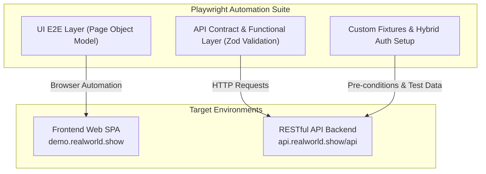

# Test Plan: Conduit (RealWorld) Automation Framework

| Metadata | Value |
| :--- | :--- |
| **Document Version** | 1.0.0 |
| **Author** | QA / SDET Lead |
| **System Under Test (SUT)** | Conduit (RealWorld) Web & REST API |
| **Framework Stack** | Playwright + TypeScript + Zod |
| **Status** | Active / Baselined |
| **Date** | 2026-08-30 |

---

## 1. Executive Summary & Purpose

The purpose of this document is to define the comprehensive **Test Strategy, Scope, Architecture, and Quality Gates** for automated testing of the **Conduit (RealWorld)** platform. 

Conduit is a production-grade Medium clone application providing a Single Page Application (SPA) front-end and a stateless RESTful JSON backend. This Test Plan serves as the engineering baseline to guarantee functional correctness, data integrity, contract adherence, and continuous quality delivery through automated CI/CD pipelines.

---

## 2. System Under Test (SUT) & Architecture

Conduit operates as a decoupled client-server architecture:



### Environment Endpoints
* **Web UI Base URL**: `https://demo.realworld.show`
* **REST API Base URL**: `https://api.realworld.show/api/` (Configurable via `API_BASE_URL` env variable)
* **API Documentation Reference**: RealWorld OpenAPI Spec

---

## 3. Test Scope

### 3.1 In-Scope (Phase 1 & Current Baseline)

| Module / Feature | Test Level | Key Objectives |
| :--- | :--- | :--- |
| **Authentication & Authorization** | API & UI | User registration, login, logout, token persistence, invalid credentials handling, empty form validations. |
| **Articles Lifecycle (CRUD)** | API & UI | Creation, retrieval, update, deletion of articles, markdown rendering, slug generation. |
| **Feeds & Discovery** | API & UI | Global feed listing, personal user feed, tag-based article filtering, pagination. |
| **Social Interactions** | API & UI | Favoriting/unfavoriting articles, following/unfollowing author profiles, favorite counts. |
| **Comments System** | API | Posting comments, listing article comments, deleting own comments, unauthenticated permissions. |
| **User Profile & Settings** | API & UI | Profile retrieval, updating user bio/image/password, profile feed inspection. |
| **Schema & Contract Validation** | API | Runtime response schema validation against strict Zod models (data types, mandatory fields, status codes). |

### 3.2 Out-of-Scope (Current Phase)
* Direct Database assertions (planned for future phases).
* Multi-factor / OAuth 3rd-party authentication (GitHub/Google login).
* Heavy performance / stress testing (> 1000 concurrent RPS).

### 3.3 Future Scope / Non-Functional Roadmapped
* Automated Accessibility audits using `@axe-core/playwright` (WCAG 2.1 Level AA).
* Visual Regression Testing for key UI views using Playwright screenshot comparisons.

---

## 4. Test Strategy & The Test Pyramid

To maximize execution velocity, stability, and bug detection efficiency, the framework applies the **Test Pyramid Principle**:

```
           / \
          / UI \       <-- Focused on User Journeys, Critical Flows & Visual State
         /------\
        /  API   \     <-- High Coverage: CRUD, Edge Cases, Auth, Contract Schemas (Fast & Reliable)
       /----------\
      / Unit/Schema\   <-- Schema Definitions & Data Factory Validations
     /--------------\
```

### 4.1 Layer Breakdown

1. **API Integration & Contract Layer (`tests/api/`)**:
   - Executes directly via Playwright's `APIRequestContext`.
   - Validates HTTP status codes, headers, and strict JSON payloads using **Zod schemas**.
   - Covers positive paths, negative status codes (400, 401, 403, 404, 422), and business rule validations.
   - Ultra-fast execution (~0.2s per test) serving as the primary regression safety net.

2. **UI End-to-End Layer (`tests/ui/`)**:
   - Structured using the **Page Object Model (POM)** pattern.
   - Utilizes resilient, user-centric locators (`page.getByRole`, `page.getByLabel`, `page.getByPlaceholder`).
   - Validates end-to-end user journeys (e.g. registration -> login -> post article -> verify on global feed -> logout).

3. **Hybrid Setup Strategy (State Optimization)**:
   - For UI tests not explicitly testing login, pre-conditions (e.g., creating test users, publishing seed articles) are orchestrated via **API calls within Playwright Fixtures** to eliminate redundant UI steps and reduce flakiness.

---

## 5. Test Design Techniques Applied

To ensure high defect-detection yields without bloated test suites, scenarios are engineered using formal test design techniques:

| Technique | Application in Framework | Example Scenario |
| :--- | :--- | :--- |
| **Equivalence Partitioning (EP)** | Authentication & Input Fields | Valid email vs. invalid format email vs. unregistered email. |
| **Boundary Value Analysis (BVA)** | Input Lengths & Pagination | Empty article title, max tag count, feed limit/offset boundaries. |
| **Decision Table Testing** | Permissions & Authorization | Authenticated vs. Anonymous user accessing `/editor` or `/settings`. |
| **State Transition Testing** | Article & Favorite Lifecycle | Article: Unfavorited -> Favorited -> Unfavorited; Follow user -> Feed update. |
| **Error Guessing / Negative Testing** | API & UI Validation | Duplicate username/email registration (422), modifying another author's article (403). |

---

## 6. Test Data Management & Isolation

1. **Zero Shared Mutable State**: Each test creates its own isolated dynamic entities (unique username, email, article title) using timestamped identifiers / random generators.
2. **Parallel Execution Safe**: Tests run with `fullyParallel: true` across multiple worker processes without race conditions or shared database locks.
3. **Automatic Tear-Down & Idempotency**: Created entities that require cleanup are deleted via API utility hooks or isolated to ephemeral test sessions.

---

## 7. Tooling & Technology Stack

| Component | Technology | Rationale |
| :--- | :--- | :--- |
| **Test Runner & Engine** | [Playwright](https://playwright.dev/) | Native async/await, auto-waiting, multi-browser engine, isolated contexts. |
| **Language** | [TypeScript](https://www.typescriptlang.org/) | Type safety, IntelliSense, autocompletion, maintainable SDET architecture. |
| **Schema Validation** | [Zod](https://zod.dev/) | Type-safe runtime JSON validation ensuring API contracts do not drift. |
| **CI / CD Orchestration** | [GitHub Actions](https://github.com/features/actions) | Automated regression triggers on Push/PR, artifact archiving, report hosting. |
| **Reporting & Observability** | Playwright HTML Reporter + Tracing | Rich execution reports with step-by-step logs, screenshots, and network traces. |

---

## 8. Quality Gates & Exit Criteria

For a build to be deemed **Release Ready** and merged into `main`:

| Metric | Target / Gate | Enforcement Method |
| :--- | :--- | :--- |
| **Smoke Suite Pass Rate** | **100%** (Zero Tolerance) | GitHub Actions CI blocking status |
| **Full Regression Pass Rate**| **>= 98%** (0 critical/blocker bugs) | CI Quality Gate |
| **Flakiness Threshold** | **0% unquarantined flaky tests** | Retry analysis with `trace: 'on-first-retry'` |
| **API Contract Schema Validity**| **100% Zod Pass** | Automated assertions in API suites |
| **Code Formatting & Linting** | **Zero errors/warnings** | Pre-test lint check in CI |

---

## 9. Defect Severity & Priority Classification

| Level | Severity | Definition | SLA / Action |
| :--- | :--- | :--- | :--- |
| **S1** | **Blocker / Critical** | Core flow broken (Auth down, Article creation fails, API 500 on valid payload). | Immediate merge freeze; fix before release. |
| **S2** | **Major** | Feature impaired with no viable workaround (e.g. Tags filter fails). | Fixed within the active sprint. |
| **S3** | **Minor** | Cosmetic or edge case issue with easy workaround (e.g. Minor UI alignment). | Backlog triage. |

---

## 10. Risk Assessment & Mitigation Strategy

| Risk Identified | Impact | Likelihood | Mitigation Strategy |
| :--- | :---: | :---: | :--- |
| **Public Demo API Rate Limits / Instability** | High | Medium | Implement smart request retries, custom headers, and fallback timeout budgets. |
| **Flaky Network / Timing Issues in UI** | Medium | Low | Use Playwright web-first assertions (`await expect(locator).toBeVisible()`) instead of arbitrary sleeps. |
| **Data Collision in Parallel Execution** | High | Low | Enforce strict dynamic data generation (`uuid` / timestamp prefixes) for every worker. |
| **API Schema Drift** | High | Low | Continuous Zod schema validation on every API response in CI. |

---

## 11. Maintenance & Review Cadence

* **Review Frequency**: After every major feature release or sprint iteration.
* **Flaky Test Policy**: Any test that fails intermittently without code changes is quarantined with a tracked bug issue and reviewed weekly.
* **Package Updates**: Dependabot configured for automated security and Playwright version updates.

